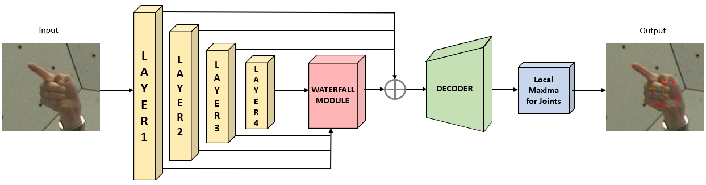
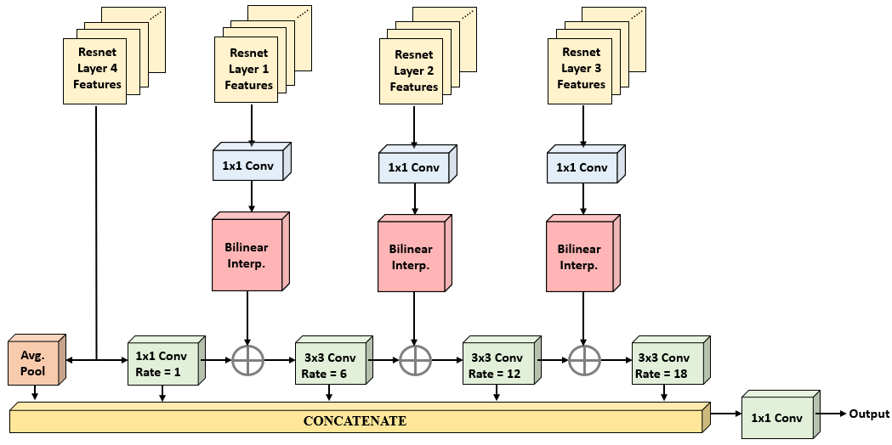
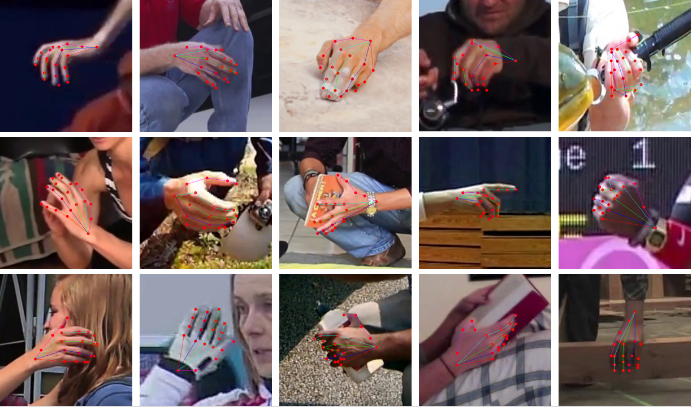

# HandyPose

  
  Figure 1: The proposed HandyPose architecture for 2D hand pose estimation. The input RGB image is fed into the ResNet-101 backbone, obtaining 400 feature maps after the concatenation of Multi-Level Waterfall outputs and MLF feature channnels. The decoder module generates heatmaps (one per joint) and exact locations of keypoints are extracted from the heatmaps by applying a local maxima function.

 

We propose HandyPose, a single-stage network  for hand pose estimation that is end to end trainable and produces state-of-the-art results. HandyPose incorporates contextual segmentation and joint localization to estimate the human pose in a single stage, with high accuracy, without relying on statistical postprocessing methods. To deal with the challenges of hand pose context and resolution, our architecture generates improved multi-scale and multi-level representations by combining features from multiple levels of the backbone network via our advanced Multi-Level Waterfall module.
A main component of our HandyPose architecture is the integration of Multi-Level Features (MLF) along with the extended Field-of-View (FOV) extracted by the multi-level Waterfall module. Our results on multiple datasets demonstrate that HandyPose, with a ResNet backbone, Multi-Level Features and Multi-Level Waterfall module, is a robust and efficient architecture for hand pose estimation obtaining state-of-the-art results in single hand pose estimation.
  
We present the advanced Multi-Level Waterfall module in Figure 2, incorporating the multi-scale extraction of the WASPv2 module with the multi-level backbone features. Multi-Level Waterfall is a novel architecture with Atrous Convolutions and multi-level features that is able to leverage both the larger Field-of-View of the WASPv2 configuration and the reduced size of the cascade approach. 
  

   
  Figure 2: The proposed "Multi-Level Waterfall" architecture for larger FOV. A multi-level and multi-scale module for achieving higher accuracy and preserving the contextual information with the introduction of (MLF) along with cascade of atrous convolutions.

  

Examples of the HandyPose architecture for Hand Pose Estimation are shown in Figures 3

   
  Figure 3: Pose estimation examples from the MPII+ NSZL dataset.

  

**Datasets:**

Datasets used in this paper and required for training, validation, and testing can be downloaded directly from the dataset websites below: 
  CMU Panoptic Dataset: http://domedb.perception.cs.cmu.edu/handdb.html 
  MPII+NZSL Dataset: http://domedb.perception.cs.cmu.edu/handdb.html 

 

**Pre-trained Models:**

The pre-trained weights can be downloaded
  <a href="">here</a>.

 

**Contact:**

  
Divyansh Gupta: 
  E-mail: dg9679@rit.edu 
  
Bruno Artacho: 
  E-mail: bmartacho@mail.rit.edu 
  Website: https://www.brunoartacho.com 
  
Andreas Savakis: 
  E-mail: andreas.savakis@rit.edu 
  Website: https://www.rit.edu/directory/axseec-andreas-savakis  

